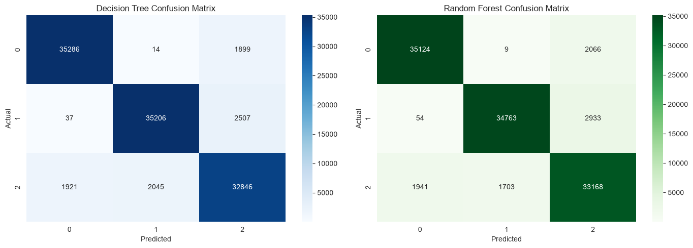
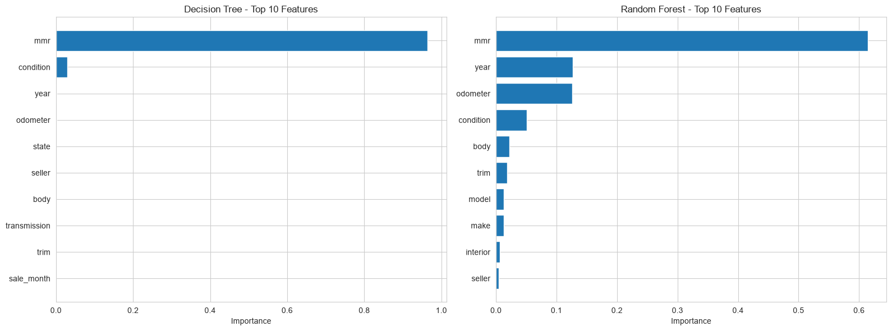
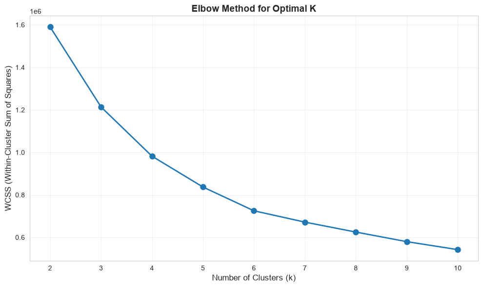
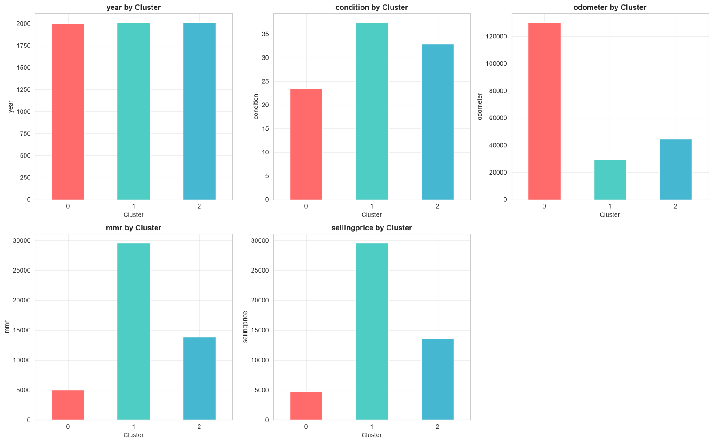
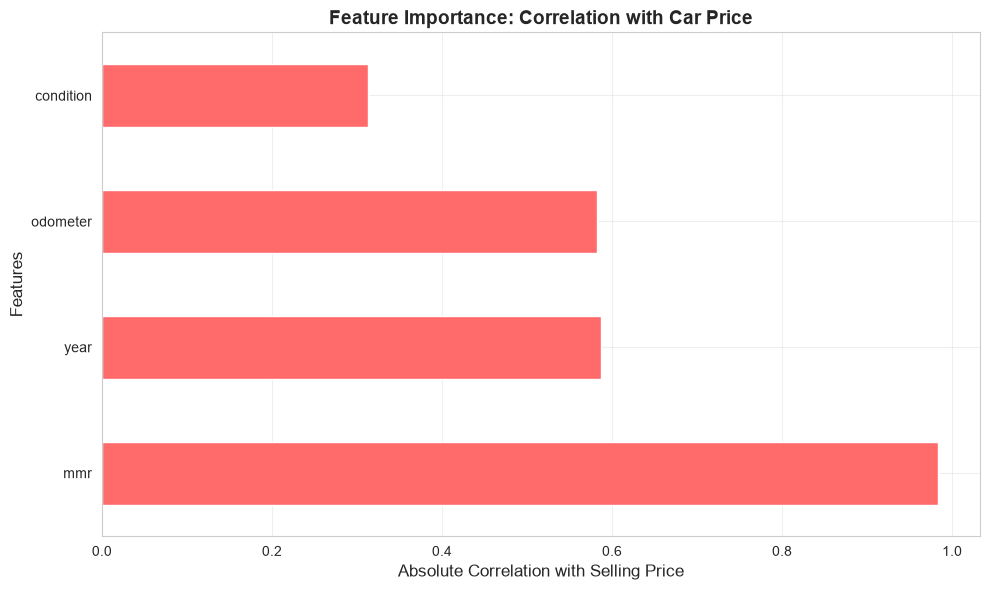
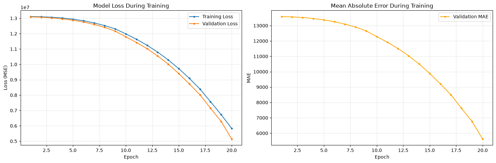
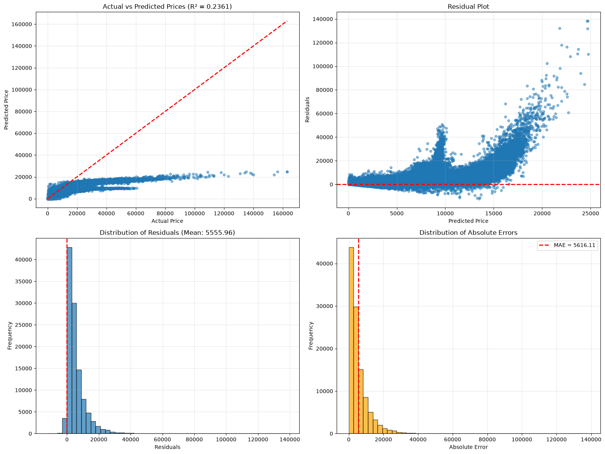

# US Vehicle Sales Analysis

An end-to-end data analytics and machine learning project analysing more than **558,000 US vehicle auction records** to identify pricing factors, segment the market and support vehicle pricing decisions.

## Project Overview

This project combines SQL, Python and machine learning to answer the following questions:

- Which factors have the strongest influence on vehicle selling prices?
- Can vehicles be classified into low, medium and high price categories?
- Can vehicles be grouped into meaningful market segments?
- Can a neural network predict vehicle selling prices?

The project includes:

- data quality checks and SQL analysis;
- data cleaning and preprocessing;
- Decision Tree and Random Forest classification;
- K-Means market segmentation;
- PyTorch MLP price prediction;
- visualisations and business insights.

For detailed SQL queries and execution notes, see the [SQL documentation](sql/README.md).

## Dataset

The dataset was obtained from Kaggle:

[Vehicle Sales Data](https://www.kaggle.com/datasets/syedanwarafridi/vehicle-sales-data)

It contains **558,837 records and 16 variables**, including:

- year, make, model and trim;
- body type and transmission;
- condition and odometer;
- MMR and selling price;
- seller, state and sale date.

The raw CSV file is not included because of its size.

Place the downloaded dataset at:

```text
data/raw/car_prices.csv
```

## My Contributions

This was originally a team project. My main contributions included:

- SQL querying;
- data cleaning and preprocessing;
- missing-value handling;
- feature preparation;
- machine learning modelling;
- model evaluation;
- business insight generation.

## Project Structure

```text
us-vehicle-sales-analysis/
│
├── data/
│   └── raw/
│       └── car_prices.csv
│
├── images/
│   ├── model_comparison.png
│   ├── confusion_matrix.png
│   ├── elbow_method.png
│   ├── kmeans_clusters.png
│   ├── cluster_feature_profiles.png
│   ├── cluster_boxplots.png
│   ├── mlp_training_loss.png
│   └── mlp_prediction_diagnostics.png
│
├── notebooks/
│   ├── 01_decision_tree_random_forest.ipynb
│   ├── 02_kmeans_clustering.ipynb
│   └── 03_mlp_price_prediction.ipynb
│
├── sql/
│   ├── README.md
│   ├── 01_data_quality_checks.sql
│   ├── 02_sales_summary.sql
│   ├── 03_top_makes_models.sql
│   ├── 04_price_and_mileage_analysis.sql
│   └── 05_state_sales_analysis.sql
│
├── requirements.txt
├── LICENSE
└── README.md
```

## Model Results

| Model | Task | Result |
|---|---|---:|
| Decision Tree | Price-category classification | 92.46% accuracy |
| Random Forest | Price-category classification | 92.21% accuracy |
| K-Means | Vehicle segmentation | 3 clusters |
| MLP | Price prediction | MAE: $5,616.11 |
| MLP | Price prediction | RMSE: $8,460.10 |
| MLP | Price prediction | R²: 0.2361 |

> Note: MMR is highly correlated with selling price, so the classification results should be interpreted with caution.

## Classification Models

The cleaned classification dataset contained **558,804 records**.

The Decision Tree achieved **92.46% accuracy**, slightly higher than the Random Forest accuracy of **92.21%**.

Both models performed strongly for low- and high-price vehicles, while the medium-price category was slightly harder to classify.

### Model Comparison



### Confusion Matrix



## Feature Importance

MMR was by far the strongest predictor, while year, mileage and condition provided additional explanatory value.

Top Random Forest features included:

| Feature | Importance |
|---|---:|
| MMR | 0.6145 |
| Year | 0.1270 |
| Odometer | 0.1262 |
| Condition | 0.0514 |
| Body type | 0.0220 |

High-price vehicles averaged approximately **34,879 miles**, compared with **118,368 miles** for low-price vehicles.

## K-Means Market Segmentation

A three-cluster solution was selected using the elbow method.

### Elbow Method



### Vehicle Segments

| Segment | Vehicles | Average price | Average year | Average mileage |
|---|---:|---:|---:|---:|
| Budget | 171,148 | $4,792 | 2005 | 130,197 miles |
| Premium | 93,741 | $29,583 | 2013 | 29,552 miles |
| Mid-range | 293,936 | $13,653 | 2012 | 44,651 miles |



### Cluster Profiles



The strongest correlations with selling price were:

| Feature | Correlation |
|---|---:|
| MMR | 0.9836 |
| Year | 0.5865 |
| Odometer | -0.5823 |
| Condition | 0.3131 |

## MLP Price Prediction

A PyTorch Multi-Layer Perceptron was developed using categorical embeddings and numerical features.

Model architecture:

```text
256 → 128 → 64 → 32 → 1
```

### Performance

| Metric | Result |
|---|---:|
| MAE | $5,616.11 |
| RMSE | $8,460.10 |
| R² | 0.2361 |
| MAPE | 39.22% |





The MLP completed training but generally underestimated expensive vehicles. It should therefore be considered an experimental baseline rather than a production-ready model.

## Key Business Insights

- MMR is the strongest indicator of final selling price.
- Newer vehicles generally retain more value.
- Lower mileage is strongly associated with higher prices.
- Better-condition vehicles are more likely to belong to premium segments.
- Dealers can use the three clusters to organise inventory into budget, mid-range and premium groups.
- Sellers should highlight mileage, condition and maintenance history.
- Buyers should compare asking prices with MMR before purchasing.

## Limitations

- The dataset contains historical auction data and may not represent current prices.
- MMR is closely related to selling price and may introduce target leakage.
- K-Means only uses numerical features.
- The MLP included high-cardinality variables such as VIN.
- The MLP performed poorly on high-price vehicles.

## Future Improvements

- Remove VIN from the neural network.
- Engineer better date and depreciation features.
- Compare Random Forest Regressor, XGBoost and LightGBM.
- Apply cross-validation and hyperparameter tuning.
- Add SHAP explanations.
- Build a Power BI or Tableau dashboard.
- Deploy the best-performing model as a web application.

## Technologies

- Python
- SQL
- Pandas
- NumPy
- Matplotlib
- Seaborn
- Plotly
- Scikit-learn
- PyTorch
- Jupyter Notebook
- Git and GitHub

## How to Run

Clone the repository:

```bash
git clone https://github.com/callmeshinny/us-vehicle-sales-analysis.git
cd us-vehicle-sales-analysis
```

Create and activate a virtual environment:

```bash
python3 -m venv .venv
source .venv/bin/activate
```

Install dependencies:

```bash
python -m pip install -r requirements.txt
```

Start Jupyter Notebook:

```bash
python -m jupyter notebook
```

Run the notebooks in this order:

1. `01_decision_tree_random_forest.ipynb`
2. `02_kmeans_clustering.ipynb`
3. `03_mlp_price_prediction.ipynb`

## Author

**Nguyen Le Nhu Ngoc**

[GitHub](https://github.com/callmeshinny) ·
[LinkedIn](https://www.linkedin.com/in/nh%C6%B0-ng%E1%BB%8Dc-nguy%E1%BB%85n-l%C3%AA-7380433ba/) ·
[Email](mailto:ngocnln.work@gmail.com)

## License

This project is licensed under the MIT License.